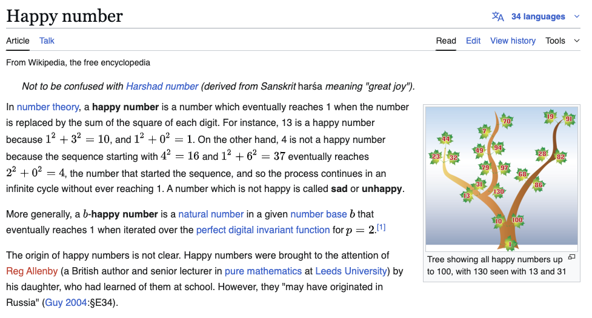

# SK - HappyNumber
Python Course - Happy Number

## 🧠 Problem Statement

### 📘 Requirements
Python 3.x

typing module (standard from Python 3.5+)

to run the code: `python3 ./solution.py`

### 📄 License
This code is based on the happy number problem from SK-Private Tutor and is for learning purposes only.
